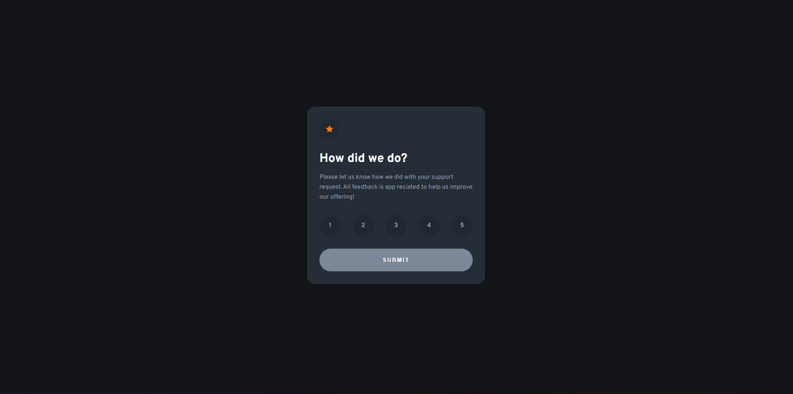

# Frontend Mentor - Interactive rating component solution

This is a solution to the [Interactive rating component challenge on Frontend Mentor](https://www.frontendmentor.io/challenges/interactive-rating-component-koxpeBUmI). Frontend Mentor challenges help you improve your coding skills by building realistic projects. 

## Table of contents

- [Overview](#overview)
  - [The challenge](#the-challenge)
  - [Screenshot](#screenshot)
  - [Links](#links)
- [My process](#my-process)
  - [Built with](#built-with)
  - [What I learned](#what-i-learned)
  - [Continued development](#continued-development)
  - [Useful resources](#useful-resources)
- [Author](#author)
- [Acknowledgments](#acknowledgments)

**Note: Delete this note and update the table of contents based on what sections you keep.**

## Overview

### The challenge

Users should be able to:

- View the optimal layout for the app depending on their device's screen size
- See hover states for all interactive elements on the page
- Select and submit a number rating
- See the "Thank you" card state after submitting a rating

### Screenshot



### Links

- Live Site URL: [Github Pages](https://lucashdoa.github.io/interactive-rating-component/)

## My process

### Built with

- Semantic HTML5 markup
- BEM CSS Architecture
- Flexbox

### What I learned

In this project I was able to practice beginner things like:

- Using CSS variables
```css
:root{
	--very-dark-blue: hsl(216, 12%, 8%);
	--dark-blue: hsl(213, 19%, 18%);
	--medium-grey: hsl(216, 12%, 54%);
	--light-grey: hsl(217, 12%, 63%);
	--white: hsl(0, 0%, 100%);
	--orange: hsl(25, 97%, 53%);
}

```

- Adding, removing and toggling CSS classes with vanilla JavaScript
```js
const ratingsList = document.querySelectorAll('.ratings__rating');

const removeSelection = (ratingsList) => {
	ratingsList.forEach(ratingElement => {
		ratingElement.classList.remove('ratings__rating__selected');
	})
}
```


### Continued development

It was my first time applying BEM and I feel like I can improve in naming the CSS classes.

### Useful resources

- [MDN Docs - Flexbox](https://developer.mozilla.org/pt-BR/docs/Learn/CSS/CSS_layout/Flexbox) - This helped me for XYZ reason. I really liked this pattern and will use it going forward.

## Author

- Website - [Soon](#)
- Frontend Mentor - [@lucashdoa](https://www.frontendmentor.io/profile/lucashdoa)
- Codewars - [@lucashdoa](https://www.codewars.com/users/lucashdoa)
- LinkedIn - [@lucashdoa](https://www.linkedin.com/in/lucashdoa/)